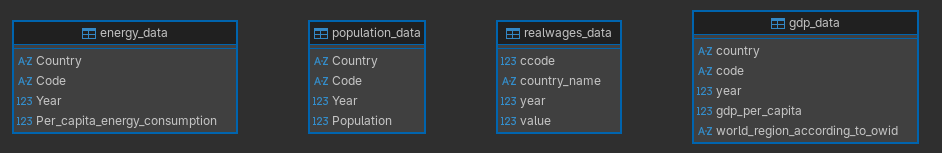
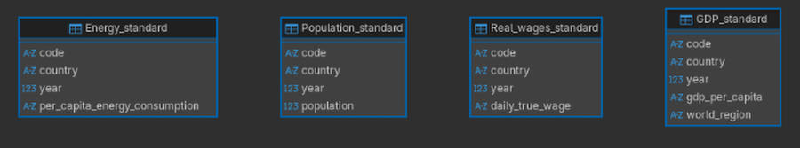
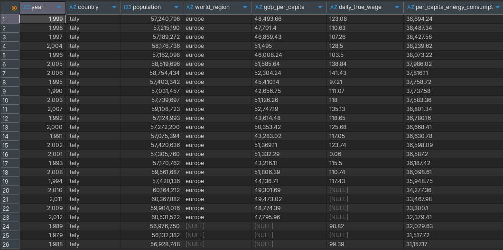
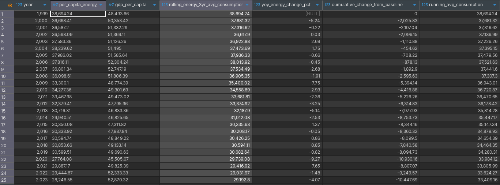

# Socio-Economic Study — SQL Data Pipeline

## Project Overview

This project uses **Python** to generate a **SQL database** file, pulling data from different local sources (CSV, XLSX), and then uses SQL to clean the dataset and generate a joint table containing all relevant information. The analysis showcases **sorting**, **filtering**, and **SQLite Window Functions**.

### Data Sources

| Source | URL |
|--------|-----|
| World Bank | https://www.worldbank.org/ |
| Our World in Data | https://ourworldindata.org/ |
| Clio Infra | https://clio-infra.eu/ |

The dataset covers several socio-economic metrics related to world population, energy consumption, and other parameters.

---

## Stack & Dependencies

```bash
# Arch Linux
pacman -Syu python-pandas python-openpyxl python-psycopg2
```

> **Note:** `sqlite3` is built into Python — no extra package needed.  
> **Note:** `openpyxl` is optional but recommended for `.xlsx` support.
> **Note:** python scripts point at local paths for csv and xlsx, you might need to edit the script to match your $HOME path

---

## Creating the SQL Database with Python

CSV and XLSX files are inspected first to filter out unnecessary data. Sheets and columns are kept largely as-is at this stage, since data cleaning and standardization is demonstrated across multiple layers (Python → SQL → Power BI).

### `gen_sql_db.py`

```python
"""
Module: gen_sql_db.py
Description: Script to load socio-economic indicators from CSV/Excel sources
             into a SQLite database. Data sources are Worldbank, OWID and clioinfra
             as shown in file names.
Author: Fabio Murtas
Dependencies: pandas, sqlite3, os, pathlib
"""

import pandas as pd
import sqlite3 as sql3
import os
from pathlib import Path

# Use environment variable 'HOME' first, then fallback to system home directory.
# This ensures the script works on different user profiles without hardcoding paths (paths could be different on your local machine).
home = os.environ['HOME'] or Path.home()

# Define absolute file paths using Path objects for cross-platform compatibility
gdp_capita    = Path(home) / 'Projects' / 'Portfolio' / 'Socio-Economic study' / '_data' / 'gdp-per-capita-worldbank' / 'gdp-per-capita-worldbank.csv'
energy_capita = Path(home) / 'Projects' / 'Portfolio' / 'Socio-Economic study' / '_data' / 'per-capita-energy-use-owid' / 'per-capita-energy-use.csv'
population    = Path(home) / 'Projects' / 'Portfolio' / 'Socio-Economic study' / '_data' / 'population-by-country-owid' / 'population.csv'
realwages     = Path(home) / 'Projects' / 'Portfolio' / 'Socio-Economic study' / '_data' / 'LabourersRealWage_Broad-clioinfra.xlsx'
db_file       = Path(home) / 'Projects' / 'Portfolio' / 'Socio-Economic study' / 'SQL' / 'social-data-gen.db'

conn = None

try:
    print("Reading data...")

    df_gdp        = pd.read_csv(gdp_capita)
    df_energy     = pd.read_csv(energy_capita)
    df_population = pd.read_csv(population)
    df_realwages  = pd.read_excel(realwages)

    print("Connecting to database...")

    # Creates the .db file if it doesn't already exist
    conn = sql3.connect(db_file)

    print("Inserting data...")

    df_gdp.to_sql(
        'gdp_data',
        conn,
        index=False,        # Don't write Pandas row index to DB
        if_exists='replace' # Drop and recreate table on each run
    )
    df_energy.to_sql('energy_data',         conn, index=False, if_exists='replace')
    df_population.to_sql('population_data', conn, index=False, if_exists='replace')

    # --- EXCEL HANDLING (Multi-Sheet Files) ---
    # ExcelFile gives a workbook object we can inspect before reading,
    # which is more efficient than calling pd.read_excel inside a blind loop.

    workbook = pd.ExcelFile(realwages)

    for i, sheet_name in enumerate(workbook.sheet_names):
        print(f"Processing Sheet {i+1}: {sheet_name}")

        df_sheet = pd.read_excel(realwages, sheet_name=sheet_name)

        # Sanitize sheet name for use as a SQLite table name
        clean_name = (
            sheet_name
            .lower()
            .replace(" ", "_")
            .replace("-", "_")
            .strip("_")
        )

        df_sheet.to_sql(clean_name, conn, index=False, if_exists='replace')

    print("Successfully imported records into SQLite database.")

except Exception as e:
    print(f"Error: {e}")

finally:
    if conn is not None:
        conn.close()
```

### Resulting Database Structure

After running the script the database contains the following tables — note the mixed naming conventions across sources, which will be standardized in the next step.



---

## SQL — Data Cleaning & Standardization

Each raw table is cleaned into a new standardized version: lowercase column names, trimmed whitespace, explicit data types, and rounded decimals.

```sql
-- Energy
CREATE TABLE "Energy_standard" AS
SELECT
  LOWER(TRIM(Code))                                           AS code,
  LOWER(TRIM(Country))                                        AS country,
  CAST(TRIM(Year) AS INTEGER)                                 AS year,
  ROUND(CAST(TRIM(Per_capita_energy_consumption) AS REAL), 2) AS per_capita_energy_consumption
FROM "energy_data";

-- GDP
CREATE TABLE "GDP_standard" AS
SELECT
  LOWER(TRIM(code))                           AS code,
  LOWER(TRIM(country))                        AS country,
  CAST(TRIM(year) AS INTEGER)                 AS year,
  ROUND(CAST(TRIM(gdp_per_capita) AS REAL), 2) AS gdp_per_capita,
  LOWER(TRIM(world_region_according_to_owid)) AS world_region
FROM "gdp_data";

-- Population
CREATE TABLE "Population_standard" AS
SELECT
  LOWER(TRIM(Code))                 AS code,
  LOWER(TRIM(Country))              AS country,
  CAST(TRIM(Year) AS INTEGER)       AS year,
  CAST(TRIM(Population) AS INTEGER) AS population
FROM "population_data";

-- Real Wages
CREATE TABLE "Real_wages_standard" AS
SELECT
  TRIM(ccode)                               AS code,
  LOWER(TRIM(country_name))                 AS country,
  CAST(TRIM(year) AS INTEGER)               AS year,
  ROUND(CAST(TRIM(value) AS REAL), 2)       AS daily_true_wage
FROM "realwages_data";
```

After running these queries, the results are saved to a new file with `.save`, and the old raw tables are removed with `DROP TABLE`. The final result is a clean, standardized database with correct field names, no ghost whitespace, and proper data types.



> Before moving to joins and aggregation, columns not needed for the analysis (e.g. `code`) are excluded. Since we're comparing metrics per country per year, the country code adds no analytical value.

---

## SQL — Building the Summary Table

The **Population** table serves as the anchor — all other tables are left-joined on `country` and `year`, so missing data appears as `NULL` rather than dropping rows.

```sql
-- =====================================================
-- SUMMARY_TABLE: merges Population, GDP, Wages, Energy
-- =====================================================

CREATE TABLE SUMMARY_TABLE AS
WITH

-- Population (anchor — defines every row)
pop AS (
  SELECT year, country, population
  FROM "Population_standard"
),

-- GDP per capita + world region
gdp AS (
  SELECT year, country, world_region, gdp_per_capita
  FROM "GDP_standard"
),

-- Daily real wages
wag AS (
  SELECT year, country, daily_true_wage
  FROM "Real_wages_standard"
),

-- Per-capita energy consumption
en AS (
  SELECT year, country, per_capita_energy_consumption
  FROM "Energy_standard"
)

SELECT
  pop.year                          AS year,
  pop.country                       AS country,
  pop.population                    AS population,
  gdp.world_region                  AS world_region,              -- NULL if no match
  gdp.gdp_per_capita                AS gdp_per_capita,            -- NULL if no match
  wag.daily_true_wage               AS daily_true_wage,           -- NULL if no match
  en.per_capita_energy_consumption  AS per_capita_energy_consumption -- NULL if no match

FROM pop
LEFT JOIN gdp ON pop.country = gdp.country AND pop.year = gdp.year
LEFT JOIN wag ON pop.country = wag.country AND pop.year = wag.year
LEFT JOIN en  ON pop.country = en.country  AND pop.year = en.year;
```

---

## Analysis — Filtering & Sorting

With the summary table in place, we can start exploring analytical questions. As a simple example: **when did Italy record its highest per-capita energy consumption?**

```sql
SELECT
  year,
  country,
  population,
  world_region,
  gdp_per_capita,
  daily_true_wage,
  per_capita_energy_consumption
FROM SUMMARY_TABLE
WHERE country = 'italy'
ORDER BY per_capita_energy_consumption DESC;
```



**Result:** Italy's highest per-capita energy consumption was recorded in **1999**.

---

## SQL — Window Functions Analysis

This section demonstrates **SQLite Window Functions** applied to Italy's energy consumption data (from 1999 onward), producing four analytical metrics in a single query.

### Output Columns

| # | Column | Window Type | Use Case |
|---|--------|-------------|----------|
| 1 | `rolling_3yr_avg_consumption` | Sliding window (3 rows) | Short-term trend smoothing |
| 2 | `yoy_energy_change_pct` | LAG function | Year-over-year growth/decline |
| 3 | `cumulative_change_from_baseline` | FIRST_VALUE (static reference) | Change from baseline year |
| 4 | `running_avg_consumption` | Cumulative window | How average evolves over time |

> **SQLite requirement:** version >= 3.25.0 for `OVER` clause support.

---

### Query

```sql
-- ============================================================
-- Energy Consumption & Economic Trend Analysis
-- OUTPUT COLUMNS: 
--   1. Rolling 3-Year Average (Sliding Window)
--   2. Year-Over-Year Change (%)
--   3. Cumulative Change from Baseline (First Value Method)
--   4. Running Average Consumption (Cumulative Window)
-- ============================================================

SELECT 

    -- Base year identifier for longitudinal analysis
    year,
    
    -- Original per-capita energy consumption (input metric)
    per_capita_energy_consumption,
    
    -- Per-capita GDP as economic control variable
    gdp_per_capita,
    
    -- ==================== METRIC 1: 3-YEAR ROLLING AVERAGE ====================
    -- Window Type: Sliding Window (Rows Between 2 Preceding And Current Row)
    -- Use Case: Short-term trend smoothing for volatility reduction
    ROUND(
        AVG(per_capita_energy_consumption) OVER (
            PARTITION BY country 
            ORDER BY year 
            ROWS BETWEEN 2 PRECEDING AND CURRENT ROW
        ),
        2
    ) AS rolling_3yr_avg_consumption,
    
    -- ==================== METRIC 2: YEAR-OVER-YEAR CHANGE (%) ====================
    -- Window Type: LAG Function (Single Row Preceding)
    -- Use Case: Calculate YoY percentage change for growth/decline analysis
    CASE 
        WHEN LAG(per_capita_energy_consumption) OVER (ORDER BY year) IS NULL 
            THEN NULL 
        ELSE ROUND(
            (
                per_capita_energy_consumption - 
                LAG(per_capita_energy_consumption) OVER (ORDER BY year)
            ) /
            NULLIF(
                LAG(per_capita_energy_consumption) OVER (ORDER BY year), 0
            ) * 100,
            2
        )
    END AS yoy_change_percentage_pct,
    
    -- ==================== METRIC 3: CUMULATIVE CHANGE FROM BASELINE ====================
    -- Window Type: First Value Function (Static Reference)
    -- Use Case: Calculate absolute decline/growth from first recorded year
    ROUND(
        per_capita_energy_consumption -
        FIRST_VALUE(per_capita_energy_consumption) OVER (ORDER BY year ROWS UNBOUNDED PRECEDING),
        2
    ) AS cumulative_change_from_baseline,
    
    -- ==================== METRIC 4: RUNNING AVERAGE CONSUMPTION ====================
    -- Window Type: Running/Cumulative Average
    -- Use Case: Track how average consumption evolves over time
    -- Note: This differs from rolling window (includes all historical data)
    ROUND(
        AVG(per_capita_energy_consumption) OVER (
            ORDER BY year 
            ROWS BETWEEN UNBOUNDED PRECEDING AND CURRENT ROW
        ),
        2
    ) AS running_avg_consumption

FROM SUMMARY_TABLE

WHERE 
    country = 'italy' AND
    year >= 1999

ORDER BY year;
```

---

### Interpretation Notes

**`rolling_3yr_avg_consumption`**
Smoothes short-term volatility for trend identification. Useful for detecting structural breaks in consumption patterns. Only reflects the most recent 3-year window, making it less sensitive to distant historical values.

**`yoy_change_percentage_pct`**
Highlights periods of growth or decline year by year. The first row will always return `NULL` due to the LAG limitation. Large percentage swings may indicate policy changes or measurement issues.

**`cumulative_change_from_baseline`**
Measures total improvement or decline from the starting point (1999). Useful for tracking long-term sustainability goals — a negative value means consumption has fallen since the baseline year.

**`running_avg_consumption`**
Shows how the historical average evolves over time. Unlike the rolling window, this includes all data from the start, making it more responsive to the latest values and useful for identifying permanent shifts in consumption behaviour.

---

### Rolling vs Running Window — Key Difference

| | Rolling (3-year) | Running (cumulative) |
|---|---|---|
| **Data included** | Last 3 years only | All years from start |
| **Noise sensitivity** | Lower | Higher |
| **Best for** | Recent trend snapshot | Long-term behavioural shifts |



By looking at this table we can begin gathering ideas for hypothesis testing. For example, even without running a test we can see at a glance that GDP per capita is not positively correlated with energy consumption but also that is not negatively correlated, hence, the table shows no direct correlation between the two metrics.
