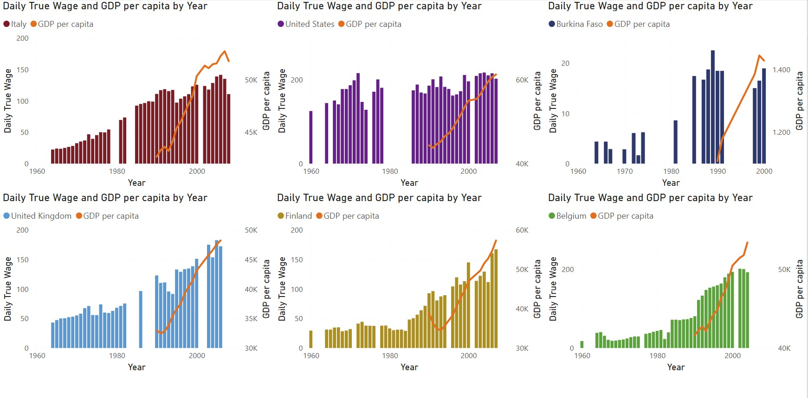

# Part 3 — Power BI Dashboard

> This is **Part 3** of a three-part data project.
> | [Part 1 — SQL](../1-SQL-section/README.md) | [Part 2 — Python](../2-Python-section/README.md) | **Part 3 — Power BI** |

---

## Overview

This section is the final stage of the pipeline. The `SUMMARY_TABLE` built in Part 1 and statistically analysed in Part 2 is now connected directly to **Power BI Desktop**, where it becomes an interactive multi-page dashboard allowing dynamic exploration of the same socio-economic indicators across countries and time periods.

The goal here shifts from computation to **communication** — translating the findings of the previous two sections into visuals that a non-technical audience can explore, filter, and interpret without writing a single line of code.

---

## Pipeline Position

```
Part 1 — SQL                 Part 2 — Python              Part 3 — Power BI
─────────────────            ─────────────────            ─────────────────
Raw CSV / XLSX          →    SQLite DB + pandas      →    Interactive Dashboard
Data engineering             Statistical analysis          Business communication
sqlite3 + Python             scipy / matplotlib            DAX + Power BI Desktop
```

---

## Data Source

Power BI connects directly to the SQLite database produced in Part 1 — the same `SUMMARY_TABLE` used throughout the project. No data transformation is repeated at this stage; the cleaning and standardisation work done in SQL carries forward intact.

**Fields used in the dashboard:**

| Field | Description |
|-------|-------------|
| `year` | Year of observation |
| `country` | Country name (standardised in Part 1) |
| `world_region` | Geographic/economic region |
| `population` | Total population |
| `gdp_per_capita` | GDP per capita (USD) |
| `daily_true_wage` | Inflation-adjusted daily real wage |
| `per_capita_energy_consumption` | Energy use per person (kWh equivalent) |

---

## DAX — Custom Measure

In addition to native Power BI aggregations, a custom **DAX measure** was created to calculate the average population across all years post-1959, iterating over distinct year values to avoid double-counting from multi-country rows:

```dax
Avg Population Post 1959 =
CALCULATE(
    AVERAGEX(
        VALUES('SUMMARY_TABLE'[Year]),
        CALCULATE(AVERAGE('SUMMARY_TABLE'[Population]))
    ),
    'SUMMARY_TABLE'[Year] > 1959
)
```

`AVERAGEX` iterates over the distinct year values returned by `VALUES()`, computing the average population for each year before averaging across years. The outer `CALCULATE` applies the year filter. This approach gives a historically meaningful baseline for comparing population dynamics across the dashboard's time range.

---

## Data Modeling & Performance Optimization

A common pitfall in corporate business intelligence is over-allocating storage resources to handle data preparation inside the reporting engine. This project enforces strict data warehousing optimization principles:

1. Pushing Transformations Upstream (The ETL Golden Rule)
To maximize model efficiency, data-cleaning, data-type enforcement, and schema standardizations were handled during the Python and SQL stages. Rather than burdening the Power BI VertiPaq engine with heavy runtime cleaning operations, a highly optimized, pre-joined SUMMARY_TABLE was imported directly from the SQLite database.

2. VertiPaq Columnar Store Compression Strategy
Calculated Columns: Strictly minimized. Because calculated columns compute at processing time and store static data row-by-row, they break the columnar compression efficiencies of Power BI and inflate the .pbix footprint.
DAX Measures: Used exclusively for all descriptive aggregations. Measures compute strictly on-the-fly at runtime within the viewer's current filter context, consuming zero memory at rest and keeping the data model remarkably lean.

Dimension Normalization: Text variables (such as country labels) were scrubbed of accidental trailing whitespaces and converted to unified casing via upstream operations before model ingestion. This reduced the cardinality of text strings, optimizing data compression and dramatically speeding up visual render times.

---

## Dashboard Pages

### Introduction and overall comparison

### Single country pages

### GDP vs Energy Consumption

Combo charts (bar + line) comparing `gdp_per_capita` and `per_capita_energy_consumption` over time, filtered by country. Six countries were selected to represent a spectrum of development profiles:

| Country | Profile |
|---------|---------|
| Italy | Southern European, post-industrial |
| United States | High-income, high-consumption |
| United Kingdom | Early deindustrialised, financialised |
| Finland | Nordic, energy-intensive industrial base |
| Belgium | Western European, highly coupled |
| Burkina Faso | Sub-Saharan developing nation |


**Key findings:**

Italy, the UK, and the US all show a clear **decoupling** pattern — GDP continues growing while energy consumption peaks and declines from the late 1990s onward. This reflects the structural shift toward service economies and the offshoring of energy-intensive manufacturing. The UK's decoupling is the sharpest and earliest, consistent with the deindustrialisation that followed the 1980s restructuring.

Finland diverges from this pattern. Energy consumption rises steeply alongside GDP through the 1990s — the country's paper/pulp industry and northern climate demands create a structurally higher energy intensity that persists longer than in other Western European peers.

Burkina Faso sits in a different world entirely. Both metrics remain near-zero throughout the entire period, illustrating persistent energy poverty — a country largely excluded from the energy and economic growth that defines the other five charts.

---

### Daily True Wage vs Energy Consumption

The same combo chart format applied to the relationship between inflation-adjusted real wages and per-capita energy use.


**Key findings:**

Italy shows wages growing in close step with energy consumption from the 1960s through the 1990s — the visible echo of the *miracolo economico*, Italy's postwar industrial boom. The correlation breaks down after 2000, when energy plateaus and wages stagnate simultaneously. This aligns with the statistical findings from Part 2: a strong Pearson correlation *(r = 0.897, R² = 0.805)* across the 1965–2008 window, statistically significant at p < 0.001.

The United States tells a sharply different story. Wages plateau and compress in real terms from the 1970s onward despite energy consumption remaining elevated — the fingerprint of the post-1973 oil shock restructuring, declining union density, and the widening gap between productivity and worker compensation that economists have documented extensively. The Part 2 statistical analysis confirms this: Pearson *r = 0.299, R² = 0.089*, not statistically significant *(p = 0.091)* — energy and wages have essentially decoupled in the US.

The UK shows high wage volatility in the 1970s–80s (stagflation, the three-day week, the miners' strikes) followed by recovery — all visible in the shape of the bars. Statistically, the UK mirrors the US: *r = 0.231, R² = 0.053*, not significant *(p = 0.189)*. Post-deindustrialisation, wages in the UK are driven by finance and services, not energy consumption.

Finland maintains the strongest coupling among all six countries: Spearman *ρ = 0.893, p < 0.001* — its industrial structure keeps wages and energy tightly linked throughout the period.

---

### Daily True Wage vs GDP per Capita

The most historically revealing combination: how closely did economic growth actually translate into worker compensation?



**Key findings:**

This page makes the **inequality story** impossible to ignore. In the US, GDP per capita curves sharply upward from the 1990s in classic exponential fashion while real wages remain flat — the canonical visual of the neoliberal era, where aggregate economic growth increasingly failed to reach median workers.

Italy shows wages and GDP tracking each other reasonably through the 1980s–90s, then diverging in the 2000s as GDP nominally grew (partly through euro-denominated asset inflation) while worker purchasing power stagnated — Italy's well-documented productivity trap made visible.

Finland and Belgium show the healthiest wage-GDP coupling in the dataset, consistent with stronger collective bargaining traditions and more compressed wage structures in Nordic and Benelux economies.

Burkina Faso presents a particularly significant case: GDP per capita shows measurable growth from the 1980s onward — driven largely by gold and cotton export revenues — while wages remain near-zero and sparsely recorded. This is commodity-driven growth that enriches national accounts without translating into broad-based prosperity for workers.

---

## Cross-Section Synthesis

The three dashboard pages, read together with the statistical results from Part 2, converge on a single narrative thread running through the entire project:

> **Energy consumption, wages, and GDP were tightly coupled during the industrial growth phase of the 20th century. From the 1970s onward, they began to decouple — but differently depending on the country's economic structure, political choices, and position in the global division of labour.**

The 1973 oil shock appears as an inflection point across nearly every Western chart. The 1990s mark a second structural break where GDP and wages diverge in the US and Italy specifically. The 2008 financial crisis is visible as a compression in several series.

What began as a data engineering exercise in Part 1 ends here as a set of historically grounded observations about how economic development, worker compensation, and energy use have evolved across six very different national trajectories.

---

## Files

```
3-PowerBI-section/
├── github-socio-eco-energy.pbix     # Power BI Desktop file
├── csv/
├── sqlite_to_csv_script/            # Python script to generate csv from database file
├── assets/
│   ├── gdp_vs_energy.jpg
│   ├── wage_vs_energy.jpg
│   └── wage_gdp.jpg
└── README.md                         # This file
```

> 🌐 **Live interactive dashboard:** [View on Power BI Service](#) *(link to be added on publish)*

---
