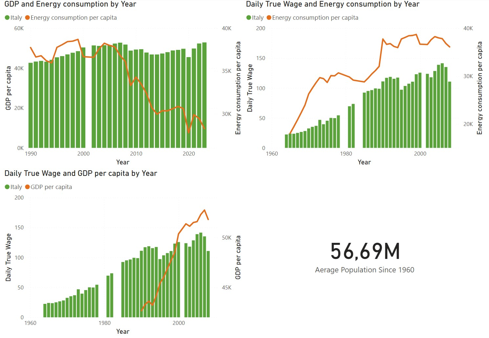
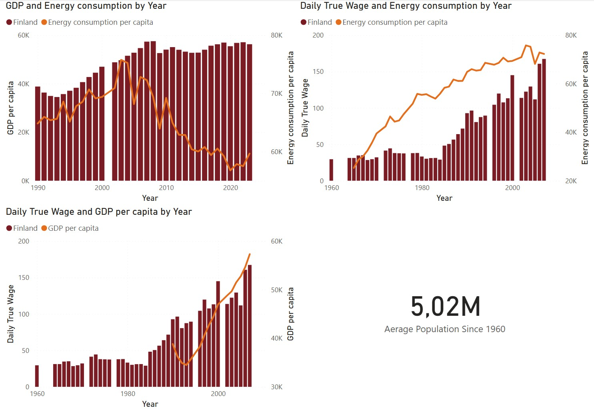
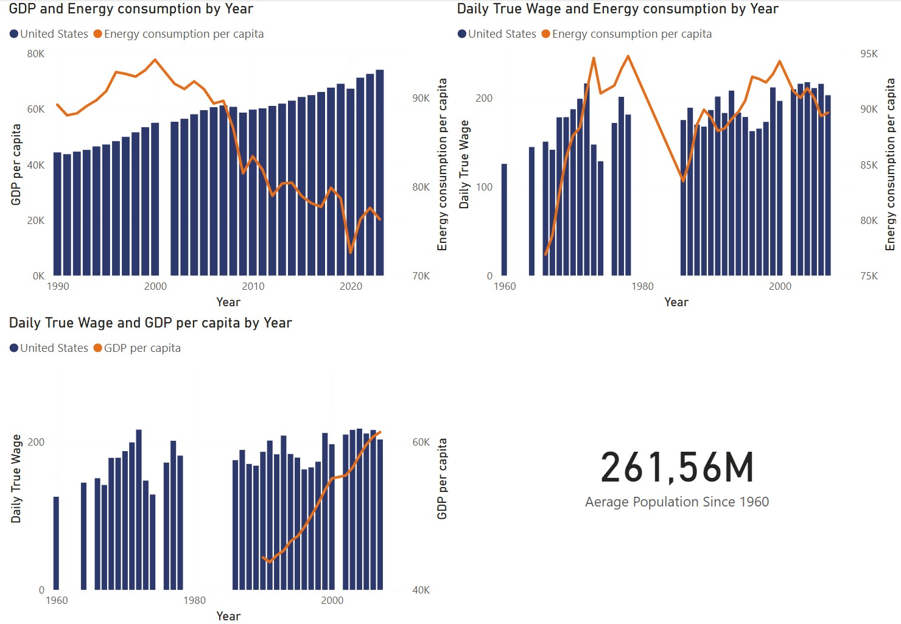
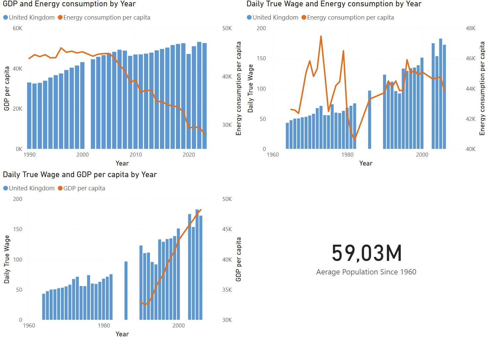
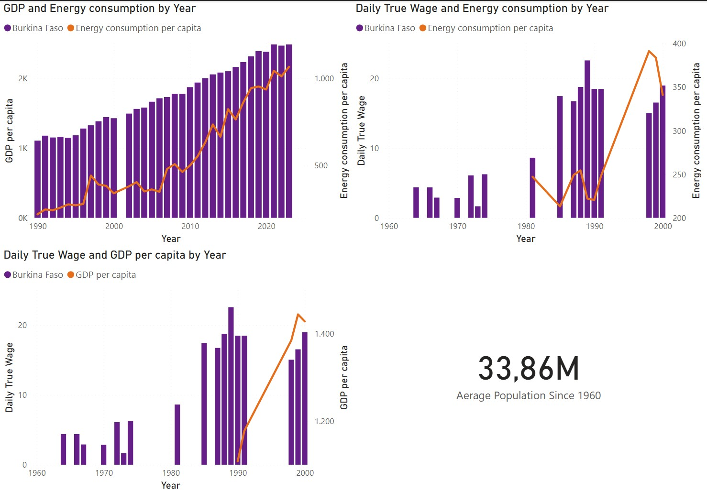
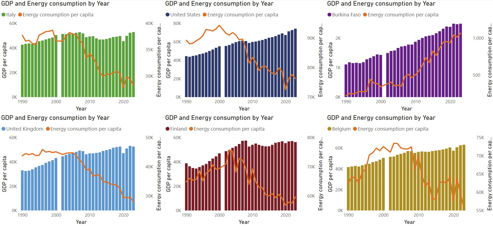
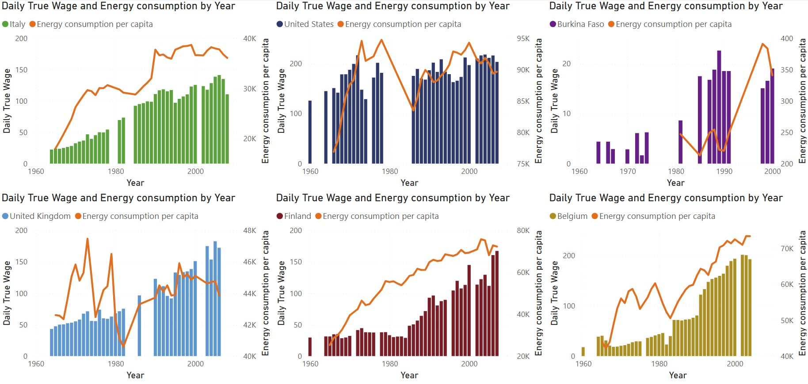
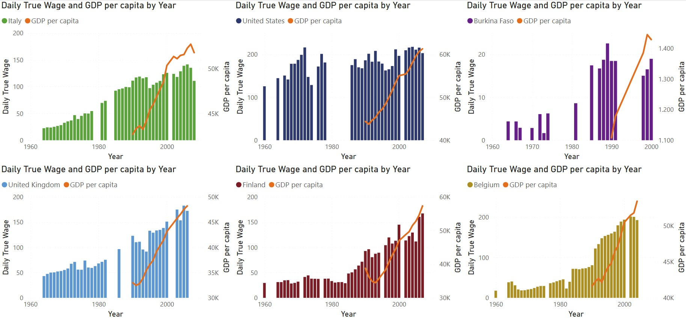

# Part 3 — Power BI Dashboard

> This is **Part 3** of a three-part data project.
> | [Part 1 — SQL](../1-SQL-section/README.md) | [Part 2 — Python](../2-Python-section/README.md) | **Part 3 — Power BI** |

---

## Overview

This section is the final stage of the pipeline. The `SUMMARY_TABLE` built in Part 1 and statistically analysed in Part 2 is now connected directly to **Power BI Desktop**, where it becomes an interactive multi-page dashboard allowing dynamic exploration of the same socio-economic indicators across countries and time periods.

The goal here shifts from computation to **communication** — translating the findings of the previous two sections into visuals that a non-technical audience can explore, filter, and interpret without writing a single line of code.

---

## Pipeline Position

```
Part 1 — SQL                 Part 2 — Python              Part 3 — Power BI
─────────────────            ─────────────────            ─────────────────
Raw CSV / XLSX          →    SQLite DB + pandas      →    Interactive Dashboard
Data engineering             Statistical analysis          Business communication
sqlite3 + Python             scipy / matplotlib            DAX + Power BI Desktop
```

---

## Data Source

Power BI connects directly to the SQLite database produced in Part 1 — the same `SUMMARY_TABLE` used throughout the project. No data transformation is repeated at this stage; the cleaning and standardisation work done in SQL carries forward intact.

**Fields used in the dashboard:**

| Field | Description |
|-------|-------------|
| `year` | Year of observation |
| `country` | Country name (standardised in Part 1) |
| `world_region` | Geographic/economic region |
| `population` | Total population |
| `gdp_per_capita` | GDP per capita (USD) |
| `daily_true_wage` | Inflation-adjusted daily real wage |
| `per_capita_energy_consumption` | Energy use per person (kWh equivalent) |

---

## DAX — Custom Measure

In addition to native Power BI aggregations, a custom **DAX measure** was created to calculate the average population across all years post-1959, iterating over distinct year values to avoid double-counting from multi-country rows:

```dax
Avg Population Post 1959 =
CALCULATE(
    AVERAGEX(
        VALUES('SUMMARY_TABLE'[Year]),
        CALCULATE(AVERAGE('SUMMARY_TABLE'[Population]))
    ),
    'SUMMARY_TABLE'[Year] > 1959
)
```

`AVERAGEX` iterates over the distinct year values returned by `VALUES()`, computing the average population for each year before averaging across years. The outer `CALCULATE` applies the year filter. This approach gives a historically meaningful baseline for comparing population dynamics across the dashboard's time range.

---

## Data Modeling & Performance Optimization

A common pitfall in corporate business intelligence is over-allocating storage resources to handle data preparation inside the reporting engine. This project enforces strict data warehousing optimization principles:

1. Pushing Transformations Upstream (The ETL Golden Rule)
To maximize model efficiency, data-cleaning, data-type enforcement, and schema standardizations were handled during the Python and SQL stages. Rather than burdening the Power BI VertiPaq engine with heavy runtime cleaning operations, a highly optimized, pre-joined SUMMARY_TABLE was imported directly from the SQLite database.

2. VertiPaq Columnar Store Compression Strategy
Calculated Columns: Strictly minimized. Because calculated columns compute at processing time and store static data row-by-row, they break the columnar compression efficiencies of Power BI and inflate the .pbix footprint.
DAX Measures: Used exclusively for all descriptive aggregations. Measures compute strictly on-the-fly at runtime within the viewer's current filter context, consuming zero memory at rest and keeping the data model remarkably lean.

Dimension Normalization: Text variables (such as country labels) were scrubbed of accidental trailing whitespaces and converted to unified casing via upstream operations before model ingestion. This reduced the cardinality of text strings, optimizing data compression and dramatically speeding up visual render times.

---

## Dashboard Pages

The following analysis reads the Power BI dashboard charts in direct conversation with the statistical results produced in Part 2. Where the Python section identified *whether* a relationship exists between wages and energy, the dashboard reveals *when* it held, *when* it broke, and *what it looked like* as it happened.

### Introduction and overall comparison

### The Comparative Overview

The stacked bar chart (countries comparison page) makes one thing immediately legible that the individual country charts cannot show: the **US dominates aggregate wages** across the entire dataset by an enormous margin. Its dark blue segment is consistently the largest in the stack, reflecting both high individual wages and a population of 261.56M. The treemap confirms the population-weighted energy consumption picture: the US block is larger than Belgium and Finland combined. Burkina Faso, with its 33.86M people, is invisible at this scale — which is precisely the point. The treemap is not a design flaw; it is a truthful representation of global inequality in energy access rendered as area.

## Statistical Results in Visual Context

Reading the charts and the statistics together, the results resolve into a coherent argument:

| Country | r (Pearson) | ρ (Spearman) | Visual Pattern | Historical Interpretation |
|---------|-------------|--------------|----------------|--------------------------|
| Italy | 0.897 ✅ | 0.875 ✅ | Tight synchrony through 2000, joint plateau after | Industrial coupling intact through the boom; stagnation broke it |
| Finland | 0.806 ✅ | 0.893 ✅ | Smooth energy curve, stepped wages catching up | Non-linear coupling; energy-intensive base precedes wage gains |
| United States | 0.299 ❌ | 0.114 ❌ | Wages peak in 1970s, energy peaks in 2000; no shared trajectory | Structural severance post-1973; wage determination decoupled from production |
| United Kingdom | 0.231 ❌ | 0.232 ❌ | High volatility 1960s–80s, smooth divergence after 1990 | Deindustrialisation complete by 1990; energy and wages respond to different systems |

> The energy-wage relationship is not a law of industrial economies. It is a **contingent institutional outcome** — and these four countries show both what it looks like when it holds, and what it looks like when it is deliberately or structurally dismantled.

---

### Single Country Panels

## Italy



**GDP vs Energy** — Italy's GDP holds remarkably flat from roughly 2000 onward, neither growing meaningfully nor collapsing, while energy consumption declines in a long, smooth arc from its ~50K peak. This is not a decoupling driven by growth — it is a decoupling driven by stagnation. The economy stopped expanding at the same time it stopped consuming energy. Both series plateau together, which is economically distinct from a country that grows while reducing energy use.

**Wage vs Energy** — This chart is the visual proof behind the statistics. From the 1960s through approximately 2000, the wage bars and the energy line climb in near-perfect synchrony — a textbook illustration of what Pearson r = 0.897 and R² = 0.805 look like when rendered as a time series. The coupling is not just statistically strong; it is visually obvious. After 2000, wages plateau and energy begins its decline, which is precisely where the linear model — with its intercept of -108.24 — stops being a reliable predictor. The development threshold has been reached and passed; the mechanism that drove the relationship no longer operates in the same way.

**Wage vs GDP** — GDP per capita (orange line) accelerates sharply from the late 1990s, briefly and dramatically overshooting wages, before the 2008 crisis pulls it back down toward where wages actually were. The convergence post-2008 is not a success story — it is GDP falling toward wages rather than wages rising toward GDP. Italy's average population of **56.69M** and the sustained flatness of both series after 2010 suggests a large economy that has reached a structural ceiling it has not yet found a way through.

## Finland



**GDP vs Energy** — Finland's energy consumption peaks sharply around **2003–2007** at nearly 60K units — the highest per-capita peak of any European country in the dataset — and then falls dramatically. GDP meanwhile grows steadily through the same period and continues rising after energy begins its decline. This is genuine decoupling, and it is more dramatic in proportional terms than Italy or the UK precisely because Finland started from such an extreme energy intensity baseline.

**Wage vs Energy** — This is the chart that explains the Pearson-Spearman inversion (r = 0.806 vs ρ = 0.893). The energy consumption line rises in an almost unbroken smooth curve from the 1960s to around 2005 — one of the most continuous upward trends in the entire dataset. Wages grow in steps with considerable year-to-year variation, creating a relationship that is strongly directional but not proportionally constant. Every time wages jump, they are catching up to an energy curve that has already moved ahead. The rank ordering is preserved throughout — Spearman captures this faithfully — but the linear fit is imperfect, which is why Pearson lags behind. The OLS slope of 2.41 confirms the steep energy cost per unit of wage gain: Finland's industrial base demanded enormous energy inputs before that energy translated into worker compensation.

**Wage vs GDP** — The most encouraging chart in the entire dataset. Wages and GDP track each other with striking closeness, both accelerating from the mid-1990s onward and arriving at similar levels by 2008. For a country of just **5.02M** people, this represents a degree of shared prosperity that is simply not visible in the larger economies. The Nordic model's distributional mechanisms — strong unions, coordinated wage bargaining, universal public services — appear in this chart as a near-perfect alignment between what the economy produced and what workers received.

## United States



**GDP vs Energy** — The US peak of roughly **80K energy units around 2000** is by far the highest in the dataset in absolute terms, and the subsequent decline to below 25K by 2023 represents the largest absolute reduction in per-capita energy consumption of any country here — a fall of more than 70%. GDP meanwhile rises almost without interruption. This is the most dramatic GDP-energy decoupling in the dataset, driven by the shift to services, efficiency gains, and the offshoring of manufacturing. But the statistics warn against reading this as a prosperity story for workers.

**Wage vs Energy** — This chart contains the single most historically significant data point in the entire dashboard. US wages peak in the early-to-mid **1970s** — the bars are at their highest around 1972–1978 — and then collapse and never fully recover to those levels. The Spearman ρ of 0.114 (p = 0.526) is essentially telling you that if you rank every year's wages and every year's energy consumption and compare those rankings, they are in near-random order. The positive Pearson intercept of 38.09 — the only positive intercept in the dataset — is visible in this chart as wages maintaining a non-zero baseline entirely independently of what energy consumption is doing. US wages after 1980 are set by something other than the industrial economy's energy metabolism.

**Wage vs GDP** — The canonical image of the neoliberal era. GDP per capita (orange) curves exponentially upward from the 1990s while wages (bars) oscillate in a compressed band. The gap between the two series widens continuously and is still widening at the end of the dataset. For a country of **261.56M** people — by far the largest in the dataset — this represents the largest absolute transfer of economic output away from worker compensation in the entire analysis. The R² of 0.089 means energy explains 9% of wages; this chart suggests the remaining 91% is being explained by mechanisms that systematically favour returns to capital over returns to labour.

### United Kingdom



**GDP vs Energy** — From 1990 onward, the UK shows the smoothest and most linear energy decline of all six countries — a steady fall from roughly 45K to below 10K while GDP rises continuously from 30K to 55K. The absence of sharp reversals or crisis-driven spikes in this part of the chart reflects the completeness of deindustrialisation: by 1990 the structural transformation was already finished. What remains is a service economy whose energy consumption declines as a matter of course.

**Wage vs Energy** — The 1960s–70s section of this chart is the most historically dense in the entire dataset. Energy consumption peaks around **1973** — the year of the oil crisis and the three-day working week — then crashes, partially recovers, and crashes again around **1984**, the year the miners' strike ended and the last significant energy-intensive industry was broken as a political force. Wages show dramatic volatility across the same period. The Pearson r of 0.231 and Spearman ρ of 0.232 being almost identical confirms what the chart shows: there is no consistent directional relationship here, just two volatile series responding to the same historical shocks without a stable structural connection between them. The OLS slope of 6.74 — the highest in the dataset — is a mathematical ghost: the steepest line fitted to the most structurally incoherent relationship.

**Wage vs GDP** — From the 1990s onward, wages and GDP track each other more closely than in the US, which is the key distinguishing feature between the two Anglo-Saxon economies. The UK's wage-GDP coupling post-deindustrialisation is meaningfully better than America's, visible in both the chart and the fact that the wage bars keep pace with the GDP line through the 2000s. This is consistent with the UK retaining stronger labour market institutions than the US through the same period, despite Thatcherite restructuring. The average population of **59.03M** — nearly identical to Italy's 56.69M — makes the direct Italy-UK statistical comparison all the more pointed: same size, same era, r = 0.897 versus r = 0.231.

### Burkina Faso



**GDP vs Energy** — GDP is growing at an accelerating rate from around 2005, reaching nearly 2.5K per capita by 2023 — a tripling in less than two decades. Energy consumption is also rising, from near-zero to approximately 1,000 units. Both metrics are growing together, which places Burkina Faso on the ascending portion of the development curve that all other countries in this dataset climbed decades ago. The absolute scale remains the defining context: Belgium's energy consumption at its historical minimum still exceeds Burkina Faso's at its maximum by a factor of roughly 60.

**Wage vs Energy** — The data sparsity in this chart is not a gap to apologise for — it is itself the finding. Wage records exist intermittently across the decades, reflecting the near-absence of formal labour markets where daily wage concepts are consistently recorded. Most economic activity occurs in subsistence agriculture and the informal sector, outside the measurement frameworks that generated wage data for the European countries. The years where data does exist — particularly the clusters around 1985–1995 — show wages that are meaningful in local context but operate on a scale invisible when plotted against European comparators.

**Wage vs GDP** — The most arresting feature is the **wage peak in the late 1980s**, where daily wage bars briefly reach their highest values in the dataset before collapsing. This corresponds chronologically to the period of Thomas Sankara's revolutionary government (1983–1987) and its immediate aftermath — a brief episode of explicit pro-worker economic policy, land redistribution, and state-led development that inflated formal wages before political instability reversed the gains. GDP per capita meanwhile was still near its historical low. This is one of the few moments in the dataset where wages briefly exceeded what GDP would predict — and it lasted less than a decade. The average population of **33.86M** — three times Finland's, three times Belgium's — combined with these near-zero absolute metrics, defines the human scale of what the other numbers in this dataset represent when they are absent.

---

### Cross Country Comparison Panels

The three multi-panel charts — GDP vs Energy, Wage vs Energy, and Wage vs GDP — each display all six countries simultaneously in a small-multiples layout. They serve a different analytical purpose than the individual country pages: where those pages reveal depth, these panels reveal **structure**. Read side by side, they make patterns visible that no single country chart can show.

---

### GDP vs Energy Consumption (All Countries)



The six-panel layout immediately sorts the countries into two visual categories before any analysis begins: countries where the orange energy line is **falling** relative to GDP bars, and countries where it is **rising**. Every wealthy nation falls into the first group. Burkina Faso alone falls into the second. This is the development gap rendered as a visual grammar.

**The decoupling spectrum across wealthy nations** is where the real comparative value lies. Italy and the UK both show moderate, gradual energy declines from the late 1990s onward while GDP holds or grows — the energy line descends slowly, almost reluctantly. Finland's energy line, by contrast, peaks sharply around 2003–2007 and then drops steeply — a more dramatic and recent transition, consistent with a country that maintained high industrial energy intensity longer than its peers before restructuring rapidly. The US shows the longest sustained decline: energy has been falling since approximately 2000 while GDP has risen almost without interruption, producing the widest absolute gap between the two series in the dataset.

Belgium is visually the most volatile in this panel. The energy line peaks early — around 1996–2000 — then shows multiple sharp drops and partial recoveries before collapsing dramatically post-2019. The GDP bars meanwhile are among the highest in the European group and grow steadily. Belgium's story is one of repeated energy shocks absorbed without permanent GDP damage, suggesting an economy with significant adaptive capacity.

Burkina Faso at this scale almost resists comparison. The GDP bars are so compressed relative to European values that the country appears to occupy a different chart entirely. Yet the energy line is clearly rising — the only country in the panel where this is true — which places it unambiguously on a development trajectory the others completed decades ago. The contrast between Burkina Faso's rising energy curve and Finland's falling one, both visible in the same panel, captures the entire span of the global energy development story in two lines.

---

### Daily True Wage vs Energy Consumption (All Countries)



This panel is analytically the richest of the three, because it is where the statistical results from Part 2 become visually legible as cross-country comparisons rather than isolated findings.

**Italy and Finland confirm their strong correlations visually.** In both panels, the relationship between the wage bars and the energy line is obviously directional — when one rises, the other follows. Italy's coupling is tighter and more linear, consistent with Pearson r = 0.897 nearly matching Spearman ρ = 0.875. Finland's energy line is smoother and more continuous than its wage bars, creating the stepped catch-up pattern that explains why Spearman ρ = 0.893 exceeds Pearson r = 0.806 — the rank ordering is preserved even when the proportionality is not.

**The US and UK panels make the null results viscerally clear.** In the US chart, the eye searches for a shared pattern between wages and energy and finds none — the orange energy line and the blue wage bars move on entirely independent trajectories across six decades. Energy peaks in 2000; wages peaked in the 1970s; neither event corresponds to the other. This is what Spearman ρ = 0.114 looks like when plotted — not a weak relationship, but the near-complete absence of one. The UK panel shows similar independence but with a different character: both series are highly volatile in the 1960s–80s, responding to the same historical shocks but without a stable structural connection, then settling into divergence after 1990. Pearson r = 0.231 and Spearman ρ = 0.232 being nearly identical is visible in the chart as a consistent absence of pattern rather than a noisy presence of one.

**Belgium emerges in this panel as perhaps the most interesting case not covered by the Part 2 statistics.** Wages grow continuously and steeply from near-zero in 1960 to among the highest values in the dataset by 2008, while energy consumption follows a peak-and-decline arc. The two series cross somewhere in the 1990s — wages overtake their historical energy dependency — and the gap between high wages and declining energy widens dramatically toward the end of the period. Belgium achieves something rare in this dataset: wages growing while energy consumption falls. This is efficiency and equity operating simultaneously.

**Burkina Faso's panel** is defined by the sparsity of wage data and the scale compression that makes both series nearly invisible when placed alongside European values. What data exists shows wages operating on a different order of magnitude entirely. The energy line, rising slowly from near-zero, tells the more consistent story here — gradual access to modern energy services for a population of 33.86M that remains largely outside the formal wage economy captured by this dataset.

---

### Panel 3 — Daily True Wage vs GDP per Capita (All Countries)



This panel delivers the project's most politically charged finding, and it does so through comparison rather than isolation. Placing all six countries side by side makes it impossible to attribute any single country's wage-GDP gap to local or idiosyncratic factors — the pattern is too consistent across too many different contexts.

**The Italy-US-UK triangle** is where the comparison is sharpest. All three show GDP per capita (orange line) eventually diverging from and exceeding wages, but the timing, speed, and magnitude differ in revealing ways. Italy's divergence is relatively recent — concentrated in the 2000s — and partly reversed by the post-2008 crisis pulling GDP back down. The US divergence is the oldest, fastest, and largest: GDP per capita curves away from wages from the early 1990s onward and the gap is still widening at the end of the dataset. The UK sits between the two: divergence is present but less extreme than the US, with wages maintaining closer contact with GDP through the 2000s than in America.

**Finland and Belgium represent the counterfactual.** Both show wage bars and GDP lines rising in close alignment throughout the dataset — not perfectly, but with a degree of co-movement that is simply absent in the US and Italian charts for the same period. Finland's wage-GDP chart is the closest thing to equitable growth visible in the entire dataset: two series climbing together, wages never falling far behind GDP. Belgium shows a similar pattern with a GDP line that accelerates sharply upward after 2000 while wages keep pace rather than falling behind. These two countries demonstrate that the wage-GDP divergence visible elsewhere is not an inevitable consequence of economic growth — it is a policy outcome.

**Burkina Faso's wage-GDP panel** contains the historically specific detail that no amount of aggregate analysis can substitute for. In the late 1980s, wage bars briefly reach values that are high relative to the country's GDP per capita at that moment — the ratio of wages to GDP is more favourable than at any other point in the dataset for this country. This corresponds to the Sankara era and its immediate aftermath: a brief period when political will drove wages upward independently of GDP. The subsequent collapse of both series, with GDP eventually recovering on a commodity-export trajectory while formal wages largely disappear from the record, tells the rest of the story. It is the sharpest illustration in the entire dataset of the difference between GDP growth and genuine worker prosperity — not as an abstract concept, but as a lived historical event visible in the data.

**Key findings:**

This page makes the **inequality story** impossible to ignore. In the US, GDP per capita curves sharply upward from the 1990s in classic exponential fashion while real wages remain flat — the canonical visual of the neoliberal era, where aggregate economic growth increasingly failed to reach median workers.

Italy shows wages and GDP tracking each other reasonably through the 1980s–90s, then diverging in the 2000s as GDP nominally grew (partly through euro-denominated asset inflation) while worker purchasing power stagnated — Italy's well-documented productivity trap made visible.

Finland and Belgium show the healthiest wage-GDP coupling in the dataset, consistent with stronger collective bargaining traditions and more compressed wage structures in Nordic and Benelux economies.

Burkina Faso presents a particularly significant case: GDP per capita shows measurable growth from the 1980s onward — driven largely by gold and cotton export revenues — while wages remain near-zero and sparsely recorded. This is commodity-driven growth that enriches national accounts without translating into broad-based prosperity for workers.

---

### Reading All Three Panels Together

The three comparison panels form a complete argument when read in sequence.

The first panel establishes that **all wealthy nations have decoupled GDP from energy** — the question is only when and how abruptly. The second panel reveals that **the energy-wage relationship held in some countries and broke in others** — and that the statistical results from Part 2 map precisely onto visual patterns that are obvious once you know what to look for. The third panel shows the consequence: **in countries where the energy-wage relationship broke down, the wage-GDP relationship broke down too**. The US and UK lose coherent energy-wage coupling in the statistics; they also show the widest wage-GDP divergence in the charts. Italy retains strong energy-wage coupling statistically; its wage-GDP chart shows the most recent and most reversible divergence. Finland retains the strongest monotonic coupling and shows the best wage-GDP alignment of any country in the dataset.

The three panels are not three separate questions. They are three views of the same underlying phenomenon: the degree to which economic systems allow — or prevent — the gains from growth and energy use to reach workers.

> ⚠️ *Cross-country comparisons are subject to data coverage variation across sources and time periods. Differences in wage measurement methodology between countries should be considered when interpreting absolute values.*

What began as a data engineering exercise in Part 1 ends here as a set of historically grounded observations about how economic development, worker compensation, and energy use have evolved across six very different national trajectories.

---

> 🌐 **Live interactive dashboard:** [View on Power BI Service](#) *(link to be added on publish)*

---
